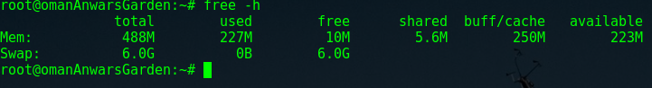

# DEPLOY.md
Instructions on deploying this project in production mode.

## Pre-Deploy  
1.  Make sure tests pass locally on server and client via *intelliJ*  
2. Build and run the project locally with `./buildAndLaunchProject.sh`(**Not on the droplet**)  
  *  `cd` into the project directory
  * `chmod+x buildAndLaunchProject.sh`
  * `./buildAndLaunchProject.sh`  
  * Go to `http://localhost:2538`, and make sure your code works.  

## :droplet: On the droplet :droplet:  
### Increasing Swap Memory  
When we build our code on the droplet, we build the project with tests,
this is to ensure that everything works just as well on the droplet as it does locally.
The problem is that a lot of our tests use substantial amounts of memory, and because our droplet is a virtual machine with restricted amounts of memory, some times we get `java.lang.OutOfMemoryError:`'s. To cope with this, we increase our swap memory from **3GB** to **6GB**. Here is how you can too!
  * You need to login on your droplet as `root`, and open a terminal. Run the following commands  
  * `free -h`: This shows you how much swap memory you have.   
    
   ``` bash   
   swapoff /swapfile  
   fallocate -l 6G /swapfile  
   chmod 600 /swapfile  
   mkswap /swapfile  
   swapon /swapfile
   ```

`free -h` again and you should see that your swap memory should have gone from 3gb to 6gb.   

### Changing IP's and Keys:
Several places in our code refer to `localhost`, and that might cause problems when deploying for public use. Change the following files to point to the right places.

#### Client - Webpack file:
*   `webpack.prod.js` : change `localhost` to the correct IP address.
Due to *https*, for us, this is `'https://revolverenguardia.dungeon.website/api/'`

#### Client - `google-charts-component.html`   
In `google-charts-component.html`, we grab an image from the server to use as a background for the bubble chart. When running locally, we tell it to go to `localhost`, but for deployment, we need to change this to the correct IP address.  
#### Server - `Server.java`  
For our QR Codes to link to the proper URL's, they need to know the IP address of the client. Before running, go to `Server.java`, and change the variable `API_URL` to equal `"http://[YOUR_IP_ADDRESS]":2538`.   
#### Changing API Key - `index.html` (If you are using google-maps)
In previous versions of our product, we have used google maps. If you would like to use google maps, you need an *API Key*.
Because we never commit and push our **API Key**, we need to add it before deployment. You can generate an API key for google maps [here](https://developers.google.com/maps/documentation/javascript/get-api-key).
Once you have your API Key, place it in the following code block where it says **YOUR_KEY**  
```html
<script async defer src="https://maps.googleapis.com/maps/api/js?key=YOUR_KEY&callback=initMap"
  type="text/javascript"></script>
```

## Starting the machine!  
Now we can start! This part is pretty simple. I made a bash script that will clean, build, gradle and start the server. I also normally use a cool tool called *tmux* to start a process, be able to walk away from deploy-user, come back, re-attach to the process, and see how the server is doing. Here are some easy steps to get the project up and running:
1. `cd` into the project directory
2. `tmux` to create a *tmux* session  
3. `chmod +x buildAndLaunchProject.sh` *buildAndLaunchProject.sh* is a bash script I made to clean, build, and start the server. chmod +x makes this file executible.
4. `./buildAndLaunchProject.sh` actually starts the script. Keep watching it until you see that the server has stared. Can easily take 5 minutes.
5. `ctrl b` and then `d` to disconnect from the *tmux* session.

And now your server is running!!! :boom:  

:octopus: :octopus: :octopus: :octopus: :octopus: :octopus: :octopus: :octopus: :octopus: :octopus: :octopus: :octopus:
