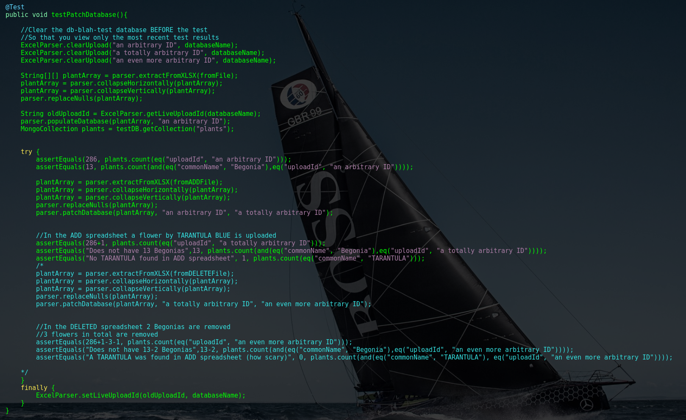

# DEPLOY.md
Instructions on deploying this project.

## General Notes  
The Google Map we have in this project requires a public key. This key is stored in `index.html` in a line that looks like this:
```html
<script async defer src="https://maps.googleapis.com/maps/api/js?key=YOUR_KEY&callback=initMap"
  type="text/javascript"></script>
```
Where `YOUR_KEY` is replaced by the public key. Go to [this](https://developers.google.com/maps/documentation/javascript/get-api-key) link  to generate a key.  
**IMPORTANT NOTE:** DO NOT COMMIT YOUR API KEY. Store it in your slack channel, and only add it to `index.html` when you need it.

## Pre-Deploy  
1.  Make sure tests pass locally on server and client via *intelliJ*  
2. Build and run the project locally with `./buildAndLaunchProject.sh`(**Not on the droplet**)  
  *  `cd` into the project directory
  * `chmod+x buildAndLaunchProject.sh`
  * `./buildAndLaunchProject.sh`    

## :droplet: On the droplet :droplet:
### Changing IP's and Keys:
Several places in our code refer to `localhost`, and that might cause problems when deploying for public use. Change the following files to point to the right places.

#### Client - Webpack file:
*   `webpack.prod.js` : change `localhost` to the correct IP address.
Due to *https*, for us, this is `'https://revolverenguardia.dungeon.website/api/'` 

#### Client - `google-charts-component.html`   
In `google-charts-component.html`, we grab an image from the server to use as a background for the bubble chart. When running locally, we tell it to go to `localhost`, but for deployment, we need to change this to the correct IP address.  
#### Server - `Server.java`  
For our QR Codes to link to the proper URL's, they need to know the IP address of the client. Before running, go to `Server.java`, and change the variable `API_URL` to equal `"http://[YOUR_IP_ADDRESS]":2538`.   
#### Changing API Key - `index.html`  
Because we never commit and push our **API Key**, we need to add it before deployment. You can generate an API key for google maps [here](https://developers.google.com/maps/documentation/javascript/get-api-key).
Once you have your API Key, place it in the following code block where it says **YOUR_KEY**  
```html
<script async defer src="https://maps.googleapis.com/maps/api/js?key=YOUR_KEY&callback=initMap"
  type="text/javascript"></script>
```
## Configuring Tests for Droplet Use  
Because the droplets run on vm's that are constrained on how much disk space and swap memory they can use, it's a miracle the project can build on digital ocean at all! If you have memory consuming tests on top of that, you are boud to get some `java.lang.OutOfMemoryError:` exceptions. In our project this happens in several places, and to fix this, there are certain tests we have to comment out in development mode.  
**Disclamer:** We only comment tests out only as a last resource, and only after the project has passed all tests in the following environments:  
  * Tests must pass on the server and client in *intelliJ*  
  * Tests must pass in a local build, using `./buildAndLaunchProject.sh`  
  * Tests must build and pass on *Travis CI*  

Only then do we  procceed to comment out tests on the droplet. Here are some tests that do fail due to `java.lang.OutOfMemoryError:`'s on the droplet, and how to fix them. The build will fail unless these tests are commented out. It's woth noting that you should only have to make these changes once. Even when you pull changes onto the droplet again, as long as you are on the same branch, the changes you made to make the project run on the droplet shouldn't change.

1. When we are testing QR codes, we use generate/read pictures which is very memory consuming. When we run these tests normally on the droplets, the build fails because two tests don't have enough memory to finish.
  * **To fix this:** comment out line 87.
```java
assertEquals("File names are equal to the bed names", files[i], bedNames[i] + ".png");
```
2. Our `@After` method in testing also does not cooperate for similar reasons. When running on the droplet.  
  * **To fix this:** Change the `@after` method (line number somewhere around `line: 100`) to look like this.
```java
@After
    public void cleanFiles() throws IOException
    {
        try {
            //Delete temp folder holding QRCodes
            Path tempFolderPath = Paths.get(this.path);
            if (Files.exists(tempFolderPath)) {
                Files.delete(tempFolderPath);
            }
            //Delete QRCode zip file
            File f = new File("./");
            String files[] = f.list();
            for(int i = 0; i < files.length; i++) {
                if(files[i].endsWith(".zip") && files[i].startsWith("QR Code Export"))
                    Files.delete(Paths.get(files[i]));
                }
            }
        catch(Exception e){
                e.printStackTrace();
        }
    }
```
3. When testing `ExcelParser.java`, we generate new spreadhseets. This causes straight up `java.lang.OutOfMemoryError:`'s.
  * **In order to make the build pass**, you need to comment out the problematic section of code.
    

## Starting the machine!  
Now we can start! This part is pretty simple. I made a bash script that will clean, build, gradle and start the server. I also normally use a cool tool called *tmux* to start a process, be able to walk away from deploy-user, come back, re-attach to the process, and see how the server is doing. Here are some easy steps to get the project up and running:
1. `cd` into the project directory
2. `tmux` to create a *tmux* session  
3. `chmod +x buildAndLaunchProject.sh` *buildAndLaunchProject.sh* is a bash script I made to clean, build, and start the server. chmod +x makes this file executible.
4. `./buildAndLaunchProject.sh` actually starts the script. Keep watching it until you see that the server has stared. Can easily take 5 minutes.
5. `ctrl b` and then `d` to disconnect from the *tmux* session.

And now your server is running!!! :boom:  

:octopus: :octopus: :octopus: :octopus: :octopus: :octopus: :octopus: :octopus: :octopus: :octopus: :octopus: :octopus:
