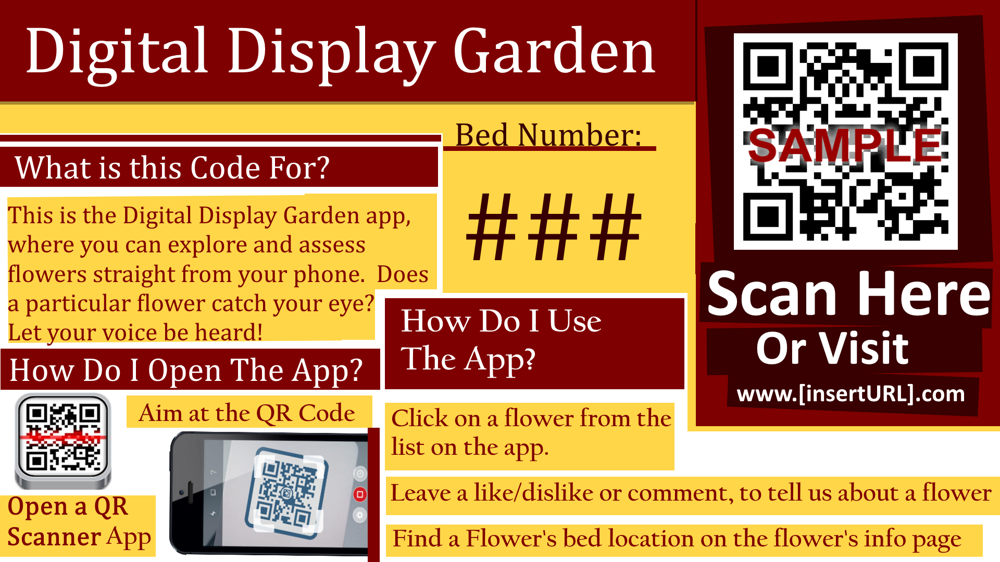

# QR Sign Suggestions

## Some Background

The Digital Display Garden application was designed for a large garden with several
flower beds.  Because of this, a system of labeled QR signs are expected (but not required) to
be placed at each bed in the garden in which the application will be operational.  The QR codes
are placed to streamline/simplify the process of launching the web-based garden app, however,
listing the URL would be helpful for those who do not have a QR scanner or do not feel inclined
to download one.  Many visitors at the garden will not be very technologically inclined, and an
explanation of the system could be useful in getting more customer feedback.  The following
section will consist of suggestions for the signs that the QR codes will be located on.

## Sign Content Suggestions

### What is this QR code for?

This is where the basics of the Digital Display Garden can be explained.  Focusing on features that would appeal to the customers can be explained. Ex: “This is
the Digital Display Garden app, where you can explore and assess flowers straight from
your phone.  Does a particular flower catch your eye? Let your voice be heard!  Scan
Here.”

### How do I open the app?

Here is where it would be helpful to include basic information on how a QR code
is read, and offer the website URL as an alternative.  Ex. “This QR code can be scanned
from your smartphone with a QR scanner app.  Simply open up your QR scanner app
and point at the code, alternatively visit us at www.[Insert-URL- Here].com.”

### What Should I do in this app?

This portion of the sign should give a brief explanation of navigating the app and
what can be done in it.  Ex: “Select a flower; find the flower that you want to talk about,
just filter out what you’re searching for and click on the name of the flower.  Tell us what
you think; Leave a like/dislike or a comment to tell us what you think about the flower.
 Looking for something in particular?  Just search for your flower and the bed it’s located
in will be displayed.”

## Sign Layout Suggestions

The sign layout is entirely up to the garden, however, it might be helpful to envision a
sample to get an idea of what the sign could look like.

 Below is an example.

